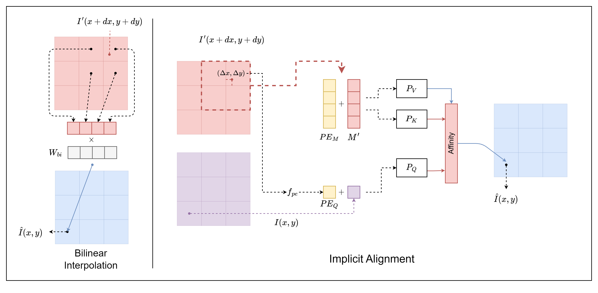
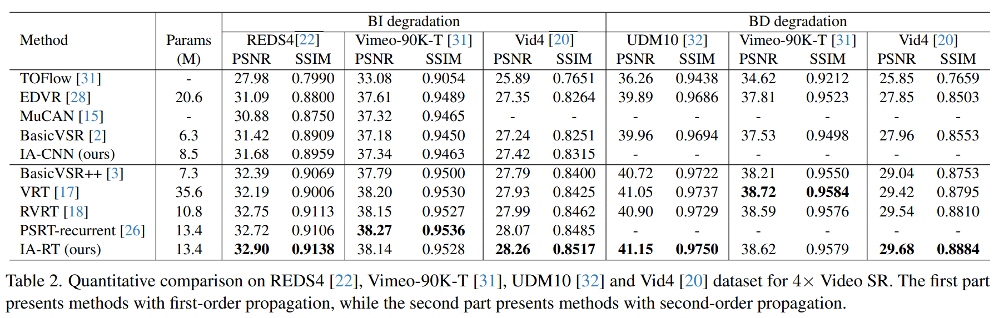

# [CVPR 2024 Highlight] Enhancing Video Super-Resolution via Implicit Resampling-based Alignment

[](https://paperswithcode.com/sota/video-super-resolution-on-reds4-4x-upscaling?p=an-implicit-alignment-for-video-super)
[](https://paperswithcode.com/sota/video-super-resolution-on-vid4-4x-upscaling?p=an-implicit-alignment-for-video-super)

**Updates:**
- April 26, 2024: We released a new model trained on Vimeo-90K with DB degradation.

- January 18, 2024: Check our [updated paper](https://github.com/kai422/IART/blob/main/arxiv.pdf) with more illustrations, speed comparisons and additional qualitative results!


This is an offical PyTorch implementation of 


>**[CVPR 2024 Highlight]** 
**Enhancing Video Super-Resolution via Implicit Resampling-based Alignment.**
>
[[Paper]](https://github.com/kai422/IART/blob/main/arxiv.pdf) [[Video]](https://www.youtube.com/watch?v=ANdgX-erbzI)
>
[Kai Xu](https://kai422.github.io/), Ziwei Yu, Xin Wang, Michael Bi Mi, [Angela Yao](https://www.comp.nus.edu.sg/~ayao/)    
Computer Vision and Machine Learning group, NUS.   


<p align="center">
  
</p>


## Results 
<p align="center">
  
</p>


## Installation

*We test the code for python-3.9, torch-1.13.1 and cuda-11.7. Similar versions will also work.*

```bash
conda create -n IART python==3.9
conda activate IART

pip install torch==1.13.1+cu117 torchvision==0.14.1+cu117 --extra-index-url https://download.pytorch.org/whl/cu117
pip install -r requirements.txt
```
## Prepare Data:

To prepare the dataset, follow [BasicSR](https://github.com/XPixelGroup/BasicSR/blob/master/docs/DatasetPreparation.md#Video-Super-Resolution). After completing the preparation, the directory structure should be as follows: 

```
datasets/
├──REDS/
│   └──val_REDS4_sharp
│   └──val_REDS4_sharp_bicubic
```

## Testing

Download models from [this link](https://drive.google.com/drive/folders/1MIUK37Izc4IcA_a3eSH-21EXOZO5G5qU?usp=sharing) and put them under `experiments/`.

```bash
# Run demo on frames under `demo/Vid4_BI`:
python demo.py

# Testing:
# For model trained on REDS dataset with BI degradation. 
python test_scripts/BI/REDS/test_IART_REDS4_N6.py
python test_scripts/BI/REDS/test_IART_REDS4_N16.py
python test_scripts/BI/REDS/test_IART_Vid4_N6.py
python test_scripts/BI/REDS/test_IART_Vid4_N16.py

# For model trained on Vimeo-90K dataset with BI degradation. 
python test_scripts/BI/Vimeo-90K/test_IART_Vid4.py
python test_scripts/BI/Vimeo-90K/test_IART_Vimeo-90K-T.py

# For model trained on Vimeo-90K dataset with BD degradation.
python test_scripts/BD/Vimeo-90K/test_IART_UDM10.py
python test_scripts/BD/Vimeo-90K/test_IART_Vid4.py
python test_scripts/BD/Vimeo-90K/test_IART_Vimeo-90K-T.py
```

## Training

The following script is for training on BI degradation. You can simply change the data for BD degradation.

```bash
# VSR trained on REDS with 6 input frames, tested on REDS4
bash dist_train.sh 8 options/IART_REDS_N6_300K.yml

# VSR trained on REDS with 16 input frames, tested on REDS4
bash dist_train.sh 8 options/IART_REDS_N16_600K.yml

# video sr trained on Vimeo, validated on Vid4
bash dist_train.sh 8 options/IART_Vimeo_N14_300K.yml
```

Due to the incompatibility of pytorch checkpoint and distributed training, the training process will terminate after the first 5000 iterations. To resume the training, execute the training script again and the previously saved parameters will be automatically loaded. This will restore the normal training procedure.


## Acknowledgment
We acknowledge the following contributors whose code served as the basis for our work:

[RethinkVSRAlignment](https://github.com/XPixelGroup/RethinkVSRAlignment), [BasicSR](https://github.com/XPixelGroup/BasicSR) and [mmediting](https://github.com/open-mmlab/mmediting).
